# 🏗️ Arquitectura de dendrita

Este diagrama representa la arquitectura completa del sistema dendrita. Fue generado automáticamente mediante el script `generate-architecture-diagram.ts`.

**Última actualización:** 2025-11-06T16:51:14.167Z

---

## 📊 Diagrama de Arquitectura

🔗 **[Ver diagrama en Mermaid Live Editor](https://mermaid.live/edit#pako:eJytWctu3DYU_RVCQYrWsOwZO-MkgyIL15sCLVAkDrroFANaupphRkMKEmfsIAnQP-iiq6Qo0kXRb-j39AeaTygfEvUYkXo4sxEp3nN0ee85Eky_8QIWgjf3VilO1uj6ckGR-D18iK6AhinhGH3DUkAveLoL-C4FvR7miz8tvJNi_PVNevrsOUQx3JE9oO-B4xAL_CXOYOH9vKBt1NuEUaA802vZ7kbnUXAuAxMhHtWGk8Qo_4UkhYATRs0-5G-XQSrR6nqqsnwphuiHlEUkhkzd-fJMx31VI5S3ljje45QJAj2wBSzxKk9TD_STHiM9s6KyDYljidIDjbpAemZF3bJ0sxWNk0A59tXk1BaPfP9ZS679YvNUesWavBrhcIe3SQxLOREp51NfTg9zrga3V3VqrWoN21rbqbW2NWzvCldRZT1a9jAc11r5HjhLF7Jmu8rlNWMbuVN11XW6hDXeE5YiYWlIgQbGKVMdXrcKoRyEd6X7JFF1qvmuIVhTEuAYfUujFGfmhWJjWYpE9yRQHSiGeQsnqLjhQAcpSZRy8tGpPba-fWucql9rir3jdSp9w1U-ZTAH0WPMVUXMWJfkR9HyLMEBoOtiobYN8R7dyeoHglegq9O8PWQLMaGAvkDfsVUTTCOyWkLGScwUWs59PT95lTGqKF7w1zGIdzPdC7nL_GskGXBO6Ep3Uw9LqHgXvxKvbvPRMEjxxq98OMwum9-LW7OQ21VPTpFfYtBVlVj-2r8XBr4ESndEvq7ktYZsxCwTnb98-qePH35BWNDuwS9u57K9QMUNJxlOg7VAh_LjWoxLKid0i6l42WxF_QX43w_v__vnV9n6BNPXfrnm5hBPCnfFXn77GxVzNyrjeANrFof6Y_vp419_oOo9N5ozFmvY73_KnNXcLzXuAivb2BoyDFVUexiqLOzgHFVhh6GqRR2GVEVth_AUlumO40ypXcx8NbOW3cT3VH638EvGkfIvCe5rgtrmBlqhxI43RMkx2haG4kAIh50bz-C2Sx-GLuv03IfDRn0Yui3Vh8VqL4K38isiL5aGyaXP5CRFNcpCCnk_7xT7GGQaBRrrFgUeaROJbfSz1oghGJcVbBi3-B3ZWeVuw3QJ3IazS5pmCVF_FOcjW4n1aj9tTzq1nbONk3cOvqfCyw0NE3mOG63zHD9W6hre7HGjO8ORTtk7kR3i78rXbgEnstMITrTVDoynTHZFXS0tUGuf6SWvuUbZQEPvZwKzlUEW0KixBtDokfJX4EZT6_0YhnLJ3o5yS96Zo1XudlSX1O1Iq8wTQcUojkUDiqGl4MVyP72fd-nd0I2SvEHfT_XVPQ0SvgGO1b4hGCn_At_o9kGTxmBdVujCug3RI2urLbqwXebowlcsUj-heg6xPrtbkySr_69EcbX8Y6MeVVkwx7UdIdUjw8NHvl14OEliApmQy8J7Wzkr08H50fCJCpUTP0sgIBEJlDlDtsWEog1ltzGEK5AU1l3UjzM15QoopDkZN4fApHEIbCE1hZWHi4Su9DyIcZZdQWQw-ugxInE8fwDTaBZFx4KbbWD-YDKdPX56k0_9WxLy9fw8uWsQyX1XSaJzmEUzQ_IITx89CeokZwckprK1dJ5EM3hqmKY3MzibdDHlNatlFImcJoYHLmbTiZPHFOe4TTi1ylVRSg7H6r8ER2VZqhGlH44aW65GVaVwXDvVPqptb0G9Y28LqVBZ6M3feHwt3gje3AshwruYe-_e_Q-mxjz_)** (haz clic para visualizar inmediatamente)

```mermaid
graph TB
    %% Dendrita Core Structure
    dendrita[".dendrita<br/>Reflexive Metadata Base"]

    %% Dendrita Components
    subgraph dendrita_components["Dendrita Components"]
        direction TB
        users["users/<br/>User Profiles<br/>(2 users)"]
        user_alvaro["alvaro"]
        user_alvaro_agents["agents/<br/>7 agents"]
        user_alvaro_skills["skills/<br/>6 skills"]
        user_alvaro_workmodes["work-modes/"]
        user_alvaro --> user_alvaro_agents
        user_alvaro --> user_alvaro_skills
        user_alvaro --> user_alvaro_workmodes
        user_example_user["example-user"]
        user_example_user_agents["agents/<br/>1 agents"]
        user_example_user_skills["skills/<br/>1 skills"]
        user_example_user_workmodes["work-modes/"]
        user_example_user --> user_example_user_agents
        user_example_user --> user_example_user_skills
        user_example_user --> user_example_user_workmodes
        users --> user_alvaro
        hooks["hooks/<br/>Behavior References<br/>(21 hooks)"]
        integrations["integrations/<br/>Technical Infrastructure"]
        integrations_services["services/<br/>10 services"]
        integrations_scripts["scripts/"]
        integrations_hooks["hooks/"]
        integrations --> integrations_services
        integrations --> integrations_scripts
        integrations --> integrations_hooks
        templates["templates/<br/>Workspace Templates"]
        comunicacion["comunicacion/<br/>Timeline & Logs"]
        config_estilo["config-estilo.json<br/>Style Conventions"]
        settings["settings.json<br/>Project Metadata"]
    end

    %% Workspaces (Example structure - each workspace follows this pattern)
    subgraph workspaces["workspaces/ - Workspace Data"]
        direction TB
        workspace_example["[workspace-name]"]
        workspace_example_projects["🚀 active-projects/"]
        workspace_example_archived[".archived-projects/"]
        workspace_example_management["⚙️ company-management/"]
        workspace_example_products["📦 products/"]
        workspace_example_stakeholders["🤝 stakeholders/"]
        workspace_example_tools["🛠️ tools-templates/"]
        workspace_example --> workspace_example_projects
        workspace_example --> workspace_example_archived
        workspace_example --> workspace_example_management
        workspace_example --> workspace_example_products
        workspace_example --> workspace_example_stakeholders
        workspace_example --> workspace_example_tools
        workspace_personal["personal"]
        workspace_personal_projects["🚀 active-projects/<br/>3 projects"]
        workspace_personal_archived[".archived-projects/"]
        workspace_personal_management["⚙️ company-management/"]
        workspace_personal_products["📦 products/"]
        workspace_personal_stakeholders["🤝 stakeholders/"]
        workspace_personal_tools["🛠️ tools-templates/"]
        workspace_personal --> workspace_personal_projects
        workspace_personal --> workspace_personal_archived
        workspace_personal --> workspace_personal_management
        workspace_personal --> workspace_personal_products
        workspace_personal --> workspace_personal_stakeholders
        workspace_personal --> workspace_personal_tools
    end

    %% Relationships
    dendrita --> dendrita_components
    dendrita_components --> users
    dendrita_components --> integrations
    dendrita -->|"applies to"| workspaces
    users -.->|"user-specific<br/>domain knowledge"| dendrita_components
    integrations -.->|"generic<br/>technical infrastructure"| dendrita_components

    %% Styling
    classDef dendritaStyle fill:#e1f5ff,stroke:#01579b,stroke-width:3px
    classDef userStyle fill:#f3e5f5,stroke:#4a148c,stroke-width:2px
    classDef workspaceStyle fill:#e8f5e9,stroke:#1b5e20,stroke-width:2px
    classDef genericStyle fill:#fff3e0,stroke:#e65100,stroke-width:2px
    class dendrita,dendrita_components dendritaStyle
    class users,user_* userStyle
    class workspace_* workspaceStyle
    class integrations,integrations_* genericStyle

```



---

## 🔄 Regenerar el Diagrama

Para regenerar este diagrama con la estructura actual:

```bash
ts-node .dendrita/scripts/generate-architecture-diagram.ts
```

O especificar un archivo de salida diferente:

```bash
ts-node .dendrita/scripts/generate-architecture-diagram.ts --output ruta/archivo.md
```

**Nota:** El script genera dos archivos:
- `ARQUITECTURA.md` - Documento Markdown completo con documentación
- `ARQUITECTURA.mmd` - Archivo Mermaid puro (solo el código del diagrama)

---

## 📝 Notas

- **.dendrita/**: Contiene metadata reflexiva del sistema (user-specific y generic)
- **workspaces/**: Contiene datos de workspaces (proyectos, productos, stakeholders)
- **User-specific**: Agents, skills y work-modes son conocimiento de dominio específico del usuario
- **Generic**: Integrations contiene infraestructura técnica genérica y reutilizable

---

**Generado por:** `generate-architecture-diagram.ts`  
**Fecha:** 2025-11-06T16:51:14.167Z
