# System Behavior: Hierarchy and Relationships

This document shows the hierarchy, relationships, and activation flows between dendrita system components.

---

## System Name

The general system is called **"dendrita"** or **"dendrita system"**. There is no specific name for the collection of hooks, agents, skills and scripts; these are collectively referred to as:

- **"dendrita system"** - The complete system
- **"dendrita components"** - Hooks, agents, skills and scripts
- **"dendrita infrastructure"** - Technical components of the system

### Layer Organization

The system is organized into two main layers:

1. **Verbal Layer**: hooks, agents, skills
   - Documentation and behavior references
   - Not executable
   - Location: `.dendrita/hooks/` and `.dendrita/users/[user-id]/agents/` and `.dendrita/users/[user-id]/skills/`

2. **Logical Layer**: scripts
   - Executable code for integrations
   - Technical infrastructure
   - Location: `.dendrita/integrations/scripts/`

### References in Documentation

In documentation they are mentioned as:
- "system of hooks, agents, skills (verbal layer) and scripts (logical layer)"
- "dendrita components"
- "dendrita system"

---

## General Hierarchy Diagram


---

## Activation Flow and Relationships

### 1. Session Start Flow

```mermaid
sequenceDiagram
    participant User
    participant Cursor
    participant SessionInit as session-initialization-verification
    participant UserProfile as profile.json
    participant Skills as skill-rules.json
    participant Scrapers as Supabase Scrapers
    
    User->>Cursor: Starts new conversation
    Cursor->>SessionInit: 🔴 CRITICAL: Reads hook
    SessionInit->>UserProfile: Verifies user and alias
    SessionInit->>Scrapers: Verifies active scrapers
    SessionInit->>Scrapers: Executes according to rules (last_sync_at)
    SessionInit->>Cursor: Configuration status
    Cursor->>User: Shows configuration summary
    Cursor->>Skills: Prepares for activation
```



### 2. Skill Activation Flow


### 3. Infrastructure Modification Flow


---

## Component Table and Relationships

### Hooks (Behavior References)

| Hook | Purpose | Activates/Uses | Related to |
|------|---------|----------------|------------|
| `session-initialization-verification` | Session start verification | User, Scrapers | `repo-initialization`, `dendrita-alias-activation` |
| `skill-activation-prompt` | Activates skills based on prompt | Skills, Agents | `skill-rules.json` |
| `dendrita-alias-activation` | Activates workspace context | Workspaces, Projects | `session-initialization-verification` |
| `dendrita-infrastructure-modification` | Modifies infrastructure | Hooks, Agents, Skills, Scripts | `dendrita-communication` |
| `dendrita-communication` | Logs changes | Timeline | `dendrita-infrastructure-modification` |
| `post-tool-use-tracker` | Tracks file changes | Workspaces, Projects | All hooks |
| `dendritify` | Converts components to dendrita | Hooks, Agents, Skills, Scripts | `dendrita-infrastructure-modification` |
| `working-context` | Maintains temporal context | `_temp/` files | `post-tool-use-tracker` |
| `journaling` | Captures work narratives | Tasks, Insights | `gestion-proyectos` skill |
| `list-system-components` | Lists system components | All components | Information |
| `dendrita-openup` | Reveals hidden insights | Workspaces, Projects | `list-system-components` |
| `dendrita-memory` | Recovers historical information | Clippings, Journaling | `journaling` |
| `dendrita-connections` | Visualizes connections | Workspaces, Projects, Stakeholders | `dendrita-openup` |
| `dendrita-suggestion` | Generates suggestions | Workspaces, Projects | `dendrita-openup` |

### Agents (User-Specific Domain Knowledge)

| Agent | Purpose | Can use Skills | Related to |
|-------|---------|----------------|------------|
| `analista-mel` | MEL analysis, metrics, reports | `sistema-mel` | `sistema-mel` skill |
| `estratega-sostenibilidad` | ESG strategy, diagnostics | `diagnostico-sostenibilidad` | `diagnostico-sostenibilidad` skill |
| `gestor-proyectos` | Operational management, tasks | `gestion-proyectos` | `gestion-proyectos` skill |
| `facilitador-aliados` | Stakeholder management, alliances | `gestion-stakeholders` | `gestion-stakeholders` skill |
| `especialista-fundraising` | Financial proposals, bootcamps | `bootcamp-fundraising`, `pipeline-proyectos` | `bootcamp-fundraising`, `pipeline-proyectos` skills |
| `web-research-specialist` | Web research | None specific | Integration hooks |
| `gestor-contexto-temporal` | Temporal context, working-context | `working-context` hook | `working-context` hook |

### Skills (User-Specific Domain Knowledge)

| Skill | Purpose | Activated by | Can suggest Agent |
|-------|---------|--------------|-------------------|
| `gestion-proyectos` | Project management patterns | `skill-activation-prompt` | `gestor-proyectos` |
| `diagnostico-sostenibilidad` | ESG diagnostic patterns | `skill-activation-prompt` | `estratega-sostenibilidad` |
| `sistema-mel` | MEL system patterns | `skill-activation-prompt` | `analista-mel` |
| `pipeline-proyectos` | Project pipeline patterns | `skill-activation-prompt` | `especialista-fundraising` |
| `bootcamp-fundraising` | Bootcamp patterns | `skill-activation-prompt` | `especialista-fundraising` |
| `gestion-stakeholders` | Stakeholder management patterns | `skill-activation-prompt` | `facilitador-aliados` |

### Scripts (Technical Infrastructure)

| Script Type | Purpose | Used by | Related to |
|-------------|---------|---------|------------|
| **Scrapers** | Data extraction (Gmail, Calendar, Drive) | Integration hooks | `calendar-scraper-setup`, `drive-scraper-setup`, `gmail-scraper-setup` |
| **Sync** | Bidirectional synchronization | Integration hooks | `supabase-sync`, `deployment-sync` |
| **Utilities** | General utilities | All | `update-emoji-backups`, `verify-markdown-source-of-truth` |
| **Pipelines** | Automated workflows | Integration hooks | `calendar-scraper-pipeline`, `drive-scraper-pipeline` |

---

## Activation Matrix

### When Each Component is Activated

| Component | Trigger | Frequency | Priority |
|-----------|---------|-----------|----------|
| `session-initialization-verification` | Conversation start | Always | 🔴 CRITICAL |
| `skill-activation-prompt` | User prompt | Every prompt | High |
| `dendrita-alias-activation` | Alias mention | When mentioned | Medium |
| `dendrita-infrastructure-modification` | `.dendrita/` modification | When modified | High |
| `dendrita-communication` | Infrastructure change | Automatic | Medium |
| Skills | Keywords/Intent in prompt | According to rules | Variable |
| Agents | Suggested by skill or explicit | Manual or suggested | Variable |
| Scripts | Manual or automatic execution | As needed | Variable |

---

## Dependency Relationships

### Direct Dependencies

```
session-initialization-verification
  ├──> profile.json (user)
  ├──> config.template.json (integrations)
  └──> Supabase (scrapers)

skill-activation-prompt
  ├──> skill-rules.json
  └──> SKILL.md files

dendrita-infrastructure-modification
  ├──> .dendrita/hooks/
  ├──> .dendrita/users/[user-id]/agents/
  ├──> .dendrita/users/[user-id]/skills/
  └──> .dendrita/integrations/scripts/

dendrita-communication
  └──> timeline.md (logs changes)
```

### Indirect Dependencies

```
Skills
  └──> Can suggest Agents
      └──> Agents can use multiple Skills

Hooks
  └──> Can activate Skills
      └──> Skills can suggest Agents
          └──> Agents can use Scripts
```

---

## Directory Structure and Hierarchy

```
.dendrita/
├── hooks/                          # Behavior Layer (Verbal)
│   ├── session-initialization-verification.md  [🔴 CRITICAL]
│   ├── skill-activation-prompt.ts
│   ├── dendrita-alias-activation.md
│   ├── dendrita-infrastructure-modification.md
│   ├── dendrita-communication.md
│   └── ... (21 hooks total)
│
├── users/[user-id]/                # Domain Knowledge Layer (User-Specific)
│   ├── agents/                     # Agents (Autonomous)
│   │   ├── analista-mel.md
│   │   ├── estratega-sostenibilidad.md
│   │   ├── gestor-proyectos.md
│   │   └── ... (7 agents total)
│   │
│   └── skills/                     # Skills (Modular Knowledge)
│       ├── skill-rules.json        # Activation rules
│       ├── gestion-proyectos/
│       │   └── SKILL.md
│       ├── diagnostico-sostenibilidad/
│       │   └── SKILL.md
│       └── ... (6 skills total)
│
└── integrations/                   # Logical Layer (Technical Infrastructure)
    ├── hooks/                      # Integration Hooks
    │   ├── google-auth-flow.md
    │   ├── supabase-setup.md
    │   ├── ssh-setup.md
    │   └── ... (14 hooks total)
    │
    └── scripts/                    # Scripts (Executable)
        ├── calendar-scraper.ts
        ├── drive-scraper.ts
        ├── sync-documents.ts
        └── ... (50+ scripts total)
```

---

## Paradigms and Principles

### Separation of Responsibilities

1. **Hooks (Behavior References)**
   - **Purpose:** Document expected behavior
   - **Nature:** References, NOT executable
   - **Scope:** Complete system

2. **Agents (User-Specific Domain Knowledge)**
   - **Purpose:** Autonomous complex tasks
   - **Nature:** User-specific domain knowledge
   - **Scope:** User-specific

3. **Skills (User-Specific Domain Knowledge)**
   - **Purpose:** Activable modular knowledge
   - **Nature:** User-specific domain knowledge
   - **Scope:** User-specific

4. **Scripts (Technical Infrastructure)**
   - **Purpose:** Technical execution
   - **Nature:** Generic technical infrastructure
   - **Scope:** Complete system

### Design Principles

- **User-Specific vs Generic:**
  - Agents and Skills are **user-specific** (domain knowledge)
  - Hooks and Scripts are **generic** (technical infrastructure)

- **Verbal Layer vs Logical Layer:**
  - Hooks, Agents, Skills = **Verbal Layer** (behavior and knowledge)
  - Scripts = **Logical Layer** (technical execution)

- **Activation Flow:**
  - Hooks activate Skills
  - Skills can suggest Agents
  - Agents can use Scripts

---

## Common Use Cases

### Case 1: User starts new conversation

```
1. session-initialization-verification (🔴 CRITICAL)
   └──> Verifies user, alias, integrations, scrapers
   
2. skill-activation-prompt (prepared)
   └──> Ready to activate skills based on prompt
```

### Case 2: User mentions "ESG diagnostic"

```
1. skill-activation-prompt
   └──> Detects keywords: "diagnostic", "ESG"
   
2. diagnostico-sostenibilidad (skill)
   └──> Activates and loads knowledge
   
3. estratega-sostenibilidad (agent)
   └──> Suggested for complex task
```

### Case 3: User modifies a hook

```
1. dendrita-infrastructure-modification
   └──> Detects modification, evaluates impact
   
2. dendrita-communication
   └──> Generates "tweet" in timeline.md
   
3. User sees confirmation of logged change
```

### Case 4: User executes scraper

```
1. Integration hook (e.g., calendar-scraper-setup)
   └──> Verifies configuration
   
2. Script (e.g., calendar-scraper.ts)
   └──> Executes scraping
   
3. Supabase
   └──> Stores data
```

---

## Important Notes

1. **Hooks are NOT executable:** They are behavior references that Cursor must read and apply reflexively.

2. **Agents and Skills are user-specific:** They contain user-specific domain knowledge, not generic infrastructure.

3. **Scripts are generic:** They contain reusable technical infrastructure.

4. **Activation is reflexive:** Cursor reads hooks and applies behavior, does not execute scripts directly.

5. **Automatic communication:** Infrastructure changes are automatically logged in timeline.

---

**Last updated:** 2025-12-02  
**Maintained by:** dendrita system  
**See also:** `.dendrita/dashboards/architecture-diagram.md`, `.dendrita/hooks/README.md`, `.dendrita/users/[user-id]/agents/README.md`, `.dendrita/users/[user-id]/skills/README.md`, `.dendrita/docs/TECHNICAL-PARADIGMS.md`

---

## Backlinks

**2025-11-06 19:09** | [Dendrita Communication Hook](../hooks/dendrita-communication.md)

This hook documents the expected behavior for automatically logging changes in timeline. It is mentioned in the activation flow diagram and in use cases.

---

**2025-11-06 19:09** | [Hooks README](../hooks/README.md)

Complete documentation of all system hooks. Mentions this document in the "See also" section.

---

